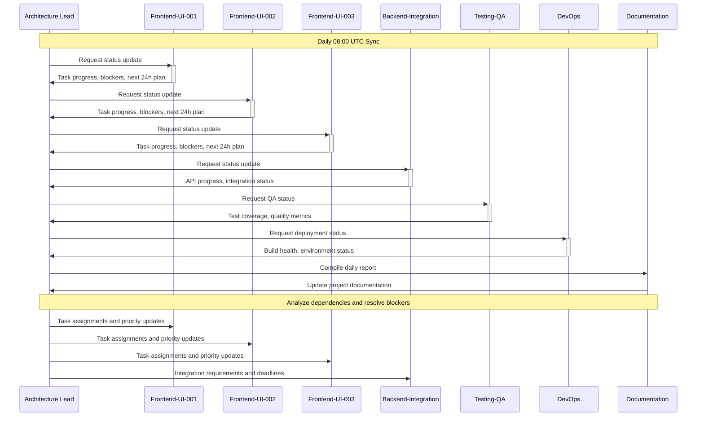
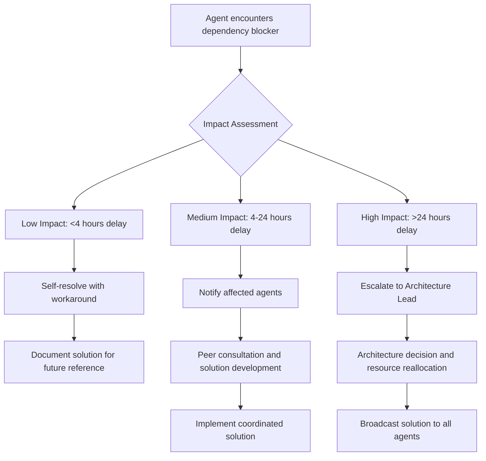
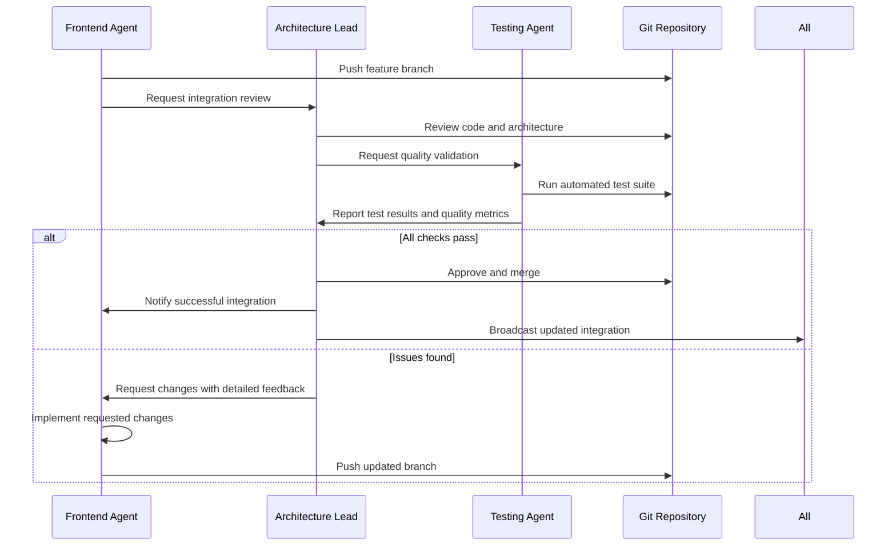

# Inter-Agent Communication Protocols

This document defines the communication patterns, message formats, and coordination mechanisms between AI agents working on the Rust-Nexus WASM UI project.

## 🔄 **Communication Architecture**

### **Communication Channels Overview**
```
┌─────────────────────┐    ┌─────────────────────┐    ┌─────────────────────┐
│  Architecture Lead  │    │   Frontend Agents   │    │  Backend Integration│
│      Agent          │◄──►│    (UI-001-003)     │◄──►│      Agent          │
└─────────────────────┘    └─────────────────────┘    └─────────────────────┘
           │                          │                          │
           ▼                          ▼                          ▼
┌─────────────────────┐    ┌─────────────────────┐    ┌─────────────────────┐
│    Testing & QA     │    │   Documentation     │    │      DevOps         │
│      Agent          │    │      Agent          │    │      Agent          │
└─────────────────────┘    └─────────────────────┘    └─────────────────────┘

                     ┌─────────────────────┐
                     │   Shared Knowledge  │
                     │       Base          │
                     └─────────────────────┘
```

### **Primary Communication Mechanisms**

#### **1. Git-Based Code Coordination**
- **Branch Management**: Each agent maintains dedicated development branches
- **Pull Request Reviews**: Automated review and integration processes
- **Merge Coordination**: Architecture Lead Agent manages integration conflicts
- **Tag-Based Releases**: Version coordination across all agents

#### **2. Documentation-Driven Communication**
- **Living Specifications**: Real-time updates to shared documentation
- **API Contracts**: Formal interface definitions between components
- **Progress Reports**: Structured status updates and milestone tracking
- **Issue Tracking**: Problem identification and resolution coordination

#### **3. Structured Message Protocols**
- **JSON-Based Messages**: Standardized format for all inter-agent communication
- **Event-Driven Updates**: Asynchronous notification of status changes
- **Request-Response Patterns**: Synchronous communication for critical decisions
- **Broadcast Notifications**: System-wide announcements and alerts

## 📨 **Message Format Specifications**

### **Standard Message Structure**
```json
{
  "message_id": "uuid-v4",
  "timestamp": "2025-08-29T20:30:00Z",
  "sender_agent_id": "frontend-ui-001",
  "recipient_agent_id": "backend-integration-001",
  "message_type": "dependency_notification",
  "priority": "high",
  "content": {
    // Message-specific payload
  },
  "requires_response": true,
  "response_timeout": 3600,
  "thread_id": "optional-conversation-thread"
}
```

### **Message Types and Payloads**

#### **1. Task Coordination Messages**
```json
{
  "message_type": "task_status_update",
  "content": {
    "task_id": "UI-008",
    "old_status": "in_progress",
    "new_status": "blocked",
    "blocker_description": "Waiting for WebSocket client implementation",
    "impact_assessment": {
      "affected_tasks": ["UI-009", "UI-010"],
      "estimated_delay": "24 hours",
      "alternative_approaches": [
        "Implement with polling fallback",
        "Mock WebSocket for parallel development"
      ]
    },
    "escalation_level": "peer_consultation"
  }
}
```

#### **2. Dependency Notifications**
```json
{
  "message_type": "dependency_notification",
  "content": {
    "dependency_type": "api_interface_change",
    "component_name": "AgentStatusService",
    "change_description": "Added real-time health metrics field",
    "breaking_change": false,
    "affected_agents": ["frontend-ui-002", "frontend-ui-003"],
    "migration_guide": "Add optional health_metrics field to AgentStatus struct",
    "compatibility_window": "1 week",
    "code_examples": [
      {
        "language": "rust",
        "code": "pub struct AgentStatus {\n    // existing fields...\n    #[serde(skip_serializing_if = \"Option::is_none\")]\n    pub health_metrics: Option<HealthMetrics>,\n}"
      }
    ]
  }
}
```

#### **3. Integration Requests**
```json
{
  "message_type": "integration_request",
  "content": {
    "request_type": "component_interface_review",
    "component_name": "RealtimeStatusDisplay",
    "interface_specification": {
      "props": {
        "agent_id": "String",
        "update_interval": "Duration",
        "on_status_change": "Callback<AgentStatusEvent>"
      },
      "events": ["StatusUpdate", "ConnectionLost", "ReconnectionAttempt"],
      "performance_requirements": {
        "max_render_time": "16ms",
        "memory_footprint": "<1MB"
      }
    },
    "integration_points": [
      {
        "agent_id": "backend-integration-001",
        "required_apis": ["get_agent_status", "subscribe_status_updates"]
      }
    ],
    "approval_required": true,
    "deadline": "2025-08-30T18:00:00Z"
  }
}
```

#### **4. Knowledge Sharing**
```json
{
  "message_type": "knowledge_sharing",
  "content": {
    "knowledge_type": "pattern_discovery",
    "title": "Optimized WASM Component Rendering Pattern",
    "description": "Discovered efficient pattern for reducing WASM<->JS boundary crossings",
    "applicability": ["all_frontend_agents"],
    "implementation_example": {
      "problem": "Excessive rendering calls causing performance issues",
      "solution": "Batch DOM updates using requestAnimationFrame",
      "code_pattern": "// Rust code pattern here",
      "performance_improvement": "40% reduction in render time"
    },
    "adoption_recommendation": "high",
    "documentation_update_required": true
  }
}
```

#### **5. Error and Issue Reporting**
```json
{
  "message_type": "error_report",
  "content": {
    "error_type": "integration_failure",
    "severity": "high",
    "component": "gRPC-Web Client",
    "error_description": "Connection timeout when connecting to rust-nexus server",
    "reproduction_steps": [
      "Initialize gRPC client with production config",
      "Attempt connection to remote server",
      "Observe timeout after 30 seconds"
    ],
    "error_details": {
      "stack_trace": "Error stack trace here",
      "environment": "development",
      "browser": "Chrome 118.0",
      "network_conditions": "local development"
    },
    "impact_assessment": {
      "affected_functionality": ["real_time_updates", "task_execution"],
      "workaround_available": true,
      "workaround_description": "Use mock data for development"
    },
    "assistance_requested": {
      "type": "investigation_support",
      "target_agents": ["backend-integration-001", "devops-001"]
    }
  }
}
```

## 🚀 **Communication Workflows**

### **1. Daily Synchronization Workflow**



### **2. Cross-Agent Dependency Resolution**



### **3. Integration and Merge Coordination**



## 🔧 **Communication Tools and Protocols**

### **1. Structured Logging for Communication**

```rust
use log::{info, warn, error};
use serde_json::json;

pub struct AgentCommunication {
    agent_id: String,
}

impl AgentCommunication {
    pub fn send_status_update(&self, task_id: &str, status: TaskStatus, details: &str) {
        info!(
            target: "agent_communication",
            "{}",
            json!({
                "message_type": "status_update",
                "sender": self.agent_id,
                "task_id": task_id,
                "status": status,
                "details": details,
                "timestamp": chrono::Utc::now().to_rfc3339()
            })
        );
    }
    
    pub fn request_assistance(&self, issue_type: &str, details: &str, target_agents: Vec<&str>) {
        warn!(
            target: "agent_communication",
            "{}",
            json!({
                "message_type": "assistance_request",
                "sender": self.agent_id,
                "issue_type": issue_type,
                "details": details,
                "target_agents": target_agents,
                "timestamp": chrono::Utc::now().to_rfc3339()
            })
        );
    }
}
```

### **2. Git Hooks for Communication Automation**

**Pre-commit Hook (`.git/hooks/pre-commit`)**:
```bash
#!/bin/bash
# Auto-generate communication messages for significant changes

# Check for breaking changes
if git diff --cached --name-only | grep -E "(lib\.rs|mod\.rs|.*\.proto)" > /dev/null; then
    echo "Detected potential breaking changes. Generating communication..."
    
    # Extract agent ID from branch name
    AGENT_ID=$(git rev-parse --abbrev-ref HEAD | sed 's/agent-development-//')
    
    # Create communication message
    cat > .communication_message.json << EOF
{
    "message_type": "potential_breaking_change",
    "sender_agent_id": "${AGENT_ID}",
    "timestamp": "$(date -u +%Y-%m-%dT%H:%M:%SZ)",
    "changes": $(git diff --cached --name-only | jq -R -s -c 'split("\n")[:-1]'),
    "requires_review": true
}
EOF
    
    git add .communication_message.json
fi
```

### **3. Automated Documentation Updates**

```rust
// Build script to generate API documentation updates
use std::process::Command;

fn main() {
    // Generate documentation for inter-agent communication
    if std::env::var("CARGO_PKG_VERSION").is_ok() {
        let output = Command::new("cargo")
            .args(&["doc", "--no-deps", "--document-private-items"])
            .output()
            .expect("Failed to generate documentation");
        
        if output.status.success() {
            // Update documentation index for other agents
            update_api_documentation_index();
        }
    }
}

fn update_api_documentation_index() {
    // Implementation for updating shared documentation
    println!("cargo:warning=Documentation updated for inter-agent coordination");
}
```

## 📊 **Communication Monitoring and Metrics**

### **Communication Health Metrics**

```json
{
  "communication_metrics": {
    "message_volume": {
      "daily_total": 156,
      "by_type": {
        "status_update": 45,
        "dependency_notification": 23,
        "integration_request": 12,
        "knowledge_sharing": 8,
        "error_report": 3
      }
    },
    "response_times": {
      "average_response_time": "47 minutes",
      "critical_response_time": "12 minutes",
      "escalation_rate": 0.08
    },
    "conflict_resolution": {
      "total_conflicts": 7,
      "auto_resolved": 5,
      "peer_resolved": 2,
      "escalated": 0,
      "average_resolution_time": "2.3 hours"
    },
    "knowledge_sharing_effectiveness": {
      "patterns_shared": 12,
      "adoption_rate": 0.85,
      "documentation_updates": 34
    }
  }
}
```

### **Communication Quality Indicators**

1. **Response Time Metrics**
   - Critical messages: <30 minutes response time
   - Standard messages: <2 hours response time
   - Knowledge sharing: <24 hours acknowledgment

2. **Resolution Effectiveness**
   - Auto-resolution rate: >70%
   - Peer resolution rate: >25%
   - Escalation rate: <5%

3. **Information Quality**
   - Message clarity score (automated analysis)
   - Required follow-up rate
   - Documentation completeness

## 🔄 **Communication Best Practices**

### **Message Composition Guidelines**

1. **Clarity and Specificity**
   - Use precise technical terminology
   - Include relevant context and background
   - Provide concrete examples and code snippets
   - Specify exact requirements and constraints

2. **Actionable Content**
   - Clear action items with deadlines
   - Specific acceptance criteria
   - Resource requirements and dependencies
   - Success metrics and validation methods

3. **Future-Oriented Information**
   - Impact on upcoming tasks and milestones
   - Compatibility considerations
   - Migration paths and upgrade strategies
   - Long-term architectural implications

### **Response Protocols**

1. **Acknowledgment Standards**
   - Immediate acknowledgment for critical messages
   - Estimated response time for complex requests
   - Interim updates for long-running investigations
   - Final resolution confirmation

2. **Information Sharing**
   - Share discoveries and optimizations immediately
   - Document solutions for common problems
   - Update shared knowledge base proactively
   - Cross-reference related work by other agents

3. **Escalation Criteria**
   - Technical decisions beyond agent expertise
   - Resource conflicts requiring prioritization
   - Timeline impacts affecting other agents
   - Security or compliance concerns

## 🛠️ **Implementation Examples**

### **Agent Communication Interface**

```rust
use async_trait::async_trait;
use serde::{Deserialize, Serialize};

#[async_trait]
pub trait AgentCommunication {
    async fn send_message(&self, message: CommunicationMessage) -> Result<(), CommunicationError>;
    async fn receive_messages(&self) -> Result<Vec<CommunicationMessage>, CommunicationError>;
    async fn subscribe_to_type(&self, message_type: MessageType) -> Result<MessageSubscription, CommunicationError>;
}

#[derive(Debug, Serialize, Deserialize)]
pub struct CommunicationMessage {
    pub id: String,
    pub sender: AgentId,
    pub recipient: Option<AgentId>,
    pub message_type: MessageType,
    pub content: serde_json::Value,
    pub timestamp: chrono::DateTime<chrono::Utc>,
    pub priority: Priority,
}

pub struct AgentCommunicationManager {
    agent_id: AgentId,
    message_bus: Arc<MessageBus>,
}

impl AgentCommunicationManager {
    pub async fn broadcast_status_update(&self, status: AgentStatus) -> Result<(), CommunicationError> {
        let message = CommunicationMessage {
            id: uuid::Uuid::new_v4().to_string(),
            sender: self.agent_id.clone(),
            recipient: None, // Broadcast
            message_type: MessageType::StatusUpdate,
            content: serde_json::to_value(status)?,
            timestamp: chrono::Utc::now(),
            priority: Priority::Standard,
        };
        
        self.send_message(message).await
    }
}
```

---

**Version**: 1.0.0  
**Last Updated**: 2025-08-29  
**Maintained By**: Architecture Lead Agent  
**Review Cycle**: Weekly optimization based on communication effectiveness metrics
