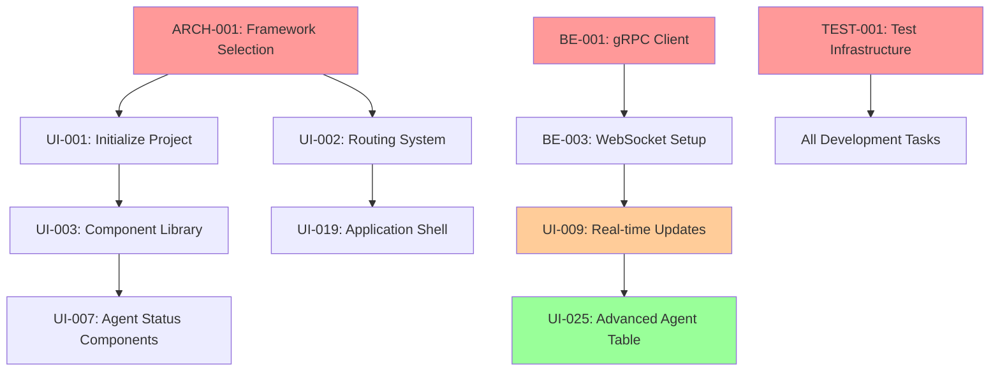

# Task Tracking Dashboard - AI Agent Project Management

This document defines the real-time task tracking and project management dashboard for coordinating AI agents working on the Rust-Nexus WASM UI project.

## 🎯 **Dashboard Overview**

The Task Tracking Dashboard provides **real-time visibility** into all aspects of the AI agent development process, enabling optimal coordination and predictive project management.

### **Dashboard Sections**

1. **Project Health Overview** - High-level metrics and status indicators
2. **Agent Performance Metrics** - Individual agent productivity and quality scores
3. **Task Management Console** - Real-time task status and assignment interface
4. **Dependency Visualization** - Interactive dependency graphs and critical path analysis
5. **Sprint Planning Interface** - Weekly planning and milestone tracking
6. **Risk Assessment Dashboard** - Predictive analytics and bottleneck identification
7. **Quality Metrics Console** - Code quality, testing, and compliance tracking

## 📊 **Real-Time Metrics Display**

### **Project Health Overview**
```json
{
  "project_status": {
    "overall_health": "green",
    "completion_percentage": 47.2,
    "estimated_delivery": "2025-12-15",
    "confidence_level": 87.3,
    "total_tasks": 89,
    "completed": 42,
    "in_progress": 31,
    "blocked": 3,
    "not_started": 13
  },
  "current_sprint": {
    "sprint_name": "Sprint 6: Advanced Features",
    "progress": 67.8,
    "days_remaining": 3,
    "velocity": 8.4,
    "burndown_trend": "on_track"
  },
  "critical_indicators": {
    "blockers": 0,
    "at_risk_tasks": 2,
    "overdue_tasks": 0,
    "quality_gates_failed": 0
  }
}
```

### **Agent Performance Dashboard**
```json
{
  "agent_metrics": {
    "architecture-lead-001": {
      "productivity_score": 94.5,
      "tasks_completed_week": 4,
      "average_completion_time": "6.2 hours",
      "quality_score": 96.1,
      "blocker_resolution_avg": "1.8 hours",
      "current_workload": "optimal",
      "specialization_efficiency": 92.3
    },
    "frontend-ui-001": {
      "productivity_score": 89.7,
      "tasks_completed_week": 7,
      "average_completion_time": "4.1 hours",
      "quality_score": 91.8,
      "component_reuse_rate": 84.2,
      "current_workload": "high",
      "code_efficiency_score": 87.6
    },
    "frontend-ui-002": {
      "productivity_score": 92.1,
      "tasks_completed_week": 6,
      "average_completion_time": "5.3 hours",
      "quality_score": 94.2,
      "integration_success_rate": 96.4,
      "current_workload": "optimal",
      "user_experience_score": 89.1
    },
    "frontend-ui-003": {
      "productivity_score": 88.4,
      "tasks_completed_week": 5,
      "average_completion_time": "6.8 hours",
      "quality_score": 90.7,
      "visualization_complexity": 91.5,
      "current_workload": "moderate",
      "data_accuracy_score": 95.3
    },
    "backend-integration-001": {
      "productivity_score": 91.3,
      "tasks_completed_week": 5,
      "average_completion_time": "7.1 hours",
      "quality_score": 93.8,
      "api_reliability_score": 97.2,
      "current_workload": "high",
      "performance_optimization": 88.9
    },
    "testing-qa-001": {
      "productivity_score": 95.8,
      "tasks_completed_week": 8,
      "average_completion_time": "3.2 hours",
      "quality_score": 98.1,
      "test_coverage_achieved": 92.7,
      "current_workload": "optimal",
      "bug_detection_rate": 94.5
    },
    "devops-001": {
      "productivity_score": 87.9,
      "tasks_completed_week": 4,
      "average_completion_time": "8.4 hours",
      "quality_score": 89.6,
      "deployment_success_rate": 100.0,
      "current_workload": "moderate",
      "automation_coverage": 91.2
    }
  }
}
```

## 📋 **Task Management Interface**

### **Interactive Task Board**
```
┌─────────────────┬─────────────────┬─────────────────┬─────────────────┐
│   NOT STARTED   │   IN PROGRESS   │     REVIEW      │   COMPLETED     │
├─────────────────┼─────────────────┼─────────────────┼─────────────────┤
│ ARCH-015        │ UI-045 (73%)    │ BE-019          │ ARCH-001 ✅     │
│ Critical        │ frontend-ui-003 │ backend-int-001 │ frontend-ui-001 │
│ Est: 4h         │ 2.1h remaining  │ Code review     │ 6.2h actual    │
│                 │                 │                 │                 │
│ UI-051          │ TEST-019 (45%)  │ UI-055          │ BE-001 ✅       │
│ High            │ testing-qa-001  │ frontend-ui-002 │ backend-int-001 │
│ Est: 6h         │ 3.3h remaining  │ Integration     │ 8.1h actual    │
│                 │                 │ testing         │                 │
│ DEVOPS-017      │ UI-058 (28%)    │                 │ TEST-001 ✅     │
│ Critical        │ frontend-ui-003 │                 │ testing-qa-001  │
│ Est: 12h        │ 8.7h remaining  │                 │ 2.8h actual    │
└─────────────────┴─────────────────┴─────────────────┴─────────────────┘
```

### **Dependency Visualization**


### **Critical Path Analysis**
The dashboard automatically identifies and highlights:
- **Longest dependency chains** that could delay project completion
- **Resource bottlenecks** where agents are overloaded
- **Integration risks** where multiple agents must coordinate
- **Quality gates** that could block progress

## 📈 **Predictive Analytics Dashboard**

### **Velocity Trending**
```json
{
  "velocity_analysis": {
    "team_velocity_trend": [7.2, 8.1, 8.9, 8.4, 9.1, 8.7], // Last 6 weeks
    "projected_completion": "2025-12-12",
    "confidence_interval": {
      "optimistic": "2025-12-08",
      "realistic": "2025-12-12", 
      "pessimistic": "2025-12-18"
    },
    "velocity_factors": {
      "learning_curve_complete": true,
      "integration_complexity": "medium",
      "external_dependencies": "low",
      "quality_requirements": "high"
    }
  }
}
```

### **Risk Heat Map**
```
Agent Workload Risk Matrix:
                    Low Load    Optimal     High Load   Overload
Frontend-UI-001        │          │           ●           │
Frontend-UI-002        │          ●           │           │  
Frontend-UI-003        │          ●           │           │
Backend-Int-001        │          │           ●           │
Testing-QA-001         │          ●           │           │
DevOps-001            │          ●           │           │
Architecture-Lead      │          ●           │           │

Critical Path Risk:
Phase 1: ████████░░ 80% (Low Risk)
Phase 2: ██████░░░░ 60% (Medium Risk) 
Phase 3: ████░░░░░░ 40% (Medium Risk)
Phase 4: ██░░░░░░░░ 20% (High Risk)
Phase 5: ░░░░░░░░░░  0% (Not Started)
```

## 🎛️ **Interactive Controls and Automation**

### **Automated Task Assignment Optimizer**
```rust
pub struct TaskAssignmentOptimizer {
    agent_capabilities: HashMap<AgentId, Vec<Skill>>,
    current_workloads: HashMap<AgentId, f32>,
    task_requirements: HashMap<TaskId, Vec<Skill>>,
    historical_performance: HashMap<(AgentId, Skill), PerformanceMetrics>,
}

impl TaskAssignmentOptimizer {
    pub fn optimize_assignments(&self, pending_tasks: &[TaskId]) -> Vec<TaskAssignment> {
        let mut assignments = Vec::new();
        
        for task_id in pending_tasks {
            let optimal_agent = self.find_optimal_agent(task_id);
            assignments.push(TaskAssignment {
                task_id: task_id.clone(),
                agent_id: optimal_agent.agent_id,
                confidence_score: optimal_agent.confidence,
                estimated_completion: optimal_agent.estimated_completion,
                alternative_agents: optimal_agent.alternatives,
            });
        }
        
        assignments
    }
    
    fn find_optimal_agent(&self, task_id: &TaskId) -> OptimalAssignment {
        // Complex algorithm considering:
        // - Agent skill match
        // - Current workload
        // - Historical performance 
        // - Task dependencies
        // - Agent availability
        todo!("Implement optimization algorithm")
    }
}
```

### **Sprint Planning Automation**
```rust
pub struct SprintPlanner {
    team_velocity: f32,
    agent_capacities: HashMap<AgentId, f32>,
    task_estimates: HashMap<TaskId, f32>,
}

impl SprintPlanner {
    pub fn plan_next_sprint(&self, available_tasks: &[TaskId], sprint_duration: u32) -> SprintPlan {
        let total_capacity = self.calculate_team_capacity(sprint_duration);
        let prioritized_tasks = self.prioritize_tasks(available_tasks);
        let optimized_assignments = self.optimize_for_dependencies(&prioritized_tasks);
        
        SprintPlan {
            selected_tasks: optimized_assignments.tasks,
            agent_assignments: optimized_assignments.assignments,
            capacity_utilization: optimized_assignments.utilization,
            risk_assessment: self.assess_sprint_risks(&optimized_assignments),
            success_probability: self.calculate_success_probability(&optimized_assignments),
        }
    }
}
```

## 📱 **Mobile and Responsive Dashboard**

### **Responsive Breakpoints**
```scss
// Dashboard responsive design
.task-dashboard {
  display: grid;
  gap: var(--spacing-md);
  
  // Desktop layout (1200px+)
  @media (min-width: 1200px) {
    grid-template-columns: 300px 1fr 350px;
    grid-template-areas: 
      "sidebar main metrics"
      "sidebar main metrics";
  }
  
  // Tablet layout (768px - 1199px)
  @media (max-width: 1199px) and (min-width: 768px) {
    grid-template-columns: 1fr;
    grid-template-areas:
      "metrics"
      "main"
      "sidebar";
  }
  
  // Mobile layout (< 768px)
  @media (max-width: 767px) {
    grid-template-columns: 1fr;
    padding: var(--spacing-sm);
    
    .task-card {
      font-size: var(--font-size-sm);
      padding: var(--spacing-sm);
    }
  }
}
```

## 🚨 **Alerting and Notifications**

### **Real-Time Alert System**
```rust
#[derive(Debug, Clone, Serialize, Deserialize)]
pub enum AlertType {
    TaskBlocked { task_id: String, blocker_reason: String },
    MissedDeadline { task_id: String, days_overdue: u32 },
    QualityGateFailure { task_id: String, metric: String, threshold: f32 },
    AgentOverload { agent_id: String, workload_percentage: f32 },
    CriticalPathDelay { milestone: String, estimated_delay: u32 },
    IntegrationConflict { components: Vec<String>, severity: String },
    PerformanceRegression { component: String, degradation: f32 },
    SecurityVulnerability { severity: String, component: String },
}

pub struct AlertManager {
    active_alerts: Vec<Alert>,
    notification_channels: Vec<NotificationChannel>,
    escalation_rules: HashMap<AlertType, EscalationRule>,
}

impl AlertManager {
    pub async fn process_alert(&mut self, alert: Alert) {
        // Check if this is a new alert or update to existing
        if self.is_duplicate_alert(&alert) {
            self.update_existing_alert(&alert);
        } else {
            self.create_new_alert(alert.clone());
        }
        
        // Send notifications based on severity
        match alert.severity {
            Severity::Critical => self.send_immediate_notifications(&alert).await,
            Severity::High => self.send_priority_notifications(&alert).await,
            Severity::Medium => self.queue_notification(&alert).await,
            Severity::Low => self.log_notification(&alert).await,
        }
    }
}
```

### **Dashboard Alert Display**
```typescript
// Real-time alert notifications in dashboard
interface AlertNotification {
  id: string;
  type: AlertType;
  severity: 'critical' | 'high' | 'medium' | 'low';
  message: string;
  timestamp: Date;
  affected_agents: string[];
  recommended_actions: string[];
  auto_dismiss_timeout?: number;
}

// Alert display component
const AlertToast: React.FC<{alert: AlertNotification}> = ({ alert }) => (
  <div className={`alert alert-${alert.severity}`}>
    <div className="alert-header">
      <AlertIcon type={alert.type} />
      <span className="alert-title">{alert.message}</span>
      <Timestamp value={alert.timestamp} />
    </div>
    <div className="alert-body">
      <div className="affected-agents">
        <strong>Affected Agents:</strong>
        {alert.affected_agents.map(agent => 
          <AgentBadge key={agent} agentId={agent} />
        )}
      </div>
      <div className="recommended-actions">
        <strong>Recommended Actions:</strong>
        <ul>
          {alert.recommended_actions.map((action, i) => 
            <li key={i}>{action}</li>
          )}
        </ul>
      </div>
    </div>
  </div>
);
```

## 📊 **Advanced Analytics Views**

### **1. Velocity Trend Analysis**
```json
{
  "velocity_trends": {
    "team_velocity": {
      "current_week": 8.7,
      "4_week_average": 8.2,
      "trend": "improving",
      "projected_next_week": 9.1
    },
    "agent_velocity_comparison": {
      "frontend-ui-001": { "current": 1.8, "average": 1.6, "trend": "improving" },
      "frontend-ui-002": { "current": 1.5, "average": 1.7, "trend": "declining" },
      "frontend-ui-003": { "current": 1.2, "average": 1.3, "trend": "stable" },
      "backend-integration-001": { "current": 1.4, "average": 1.5, "trend": "stable" },
      "testing-qa-001": { "current": 2.1, "average": 1.9, "trend": "improving" },
      "devops-001": { "current": 0.7, "average": 0.8, "trend": "stable" }
    },
    "velocity_factors": {
      "complexity_increase": 0.15,
      "integration_overhead": 0.08,
      "learning_curve": 0.02,
      "tool_efficiency": 0.12
    }
  }
}
```

### **2. Quality Metrics Dashboard**
```json
{
  "quality_metrics": {
    "code_quality": {
      "overall_score": 92.4,
      "test_coverage": 91.7,
      "static_analysis_score": 94.8,
      "documentation_coverage": 89.3,
      "security_scan_score": 96.2
    },
    "agent_quality_scores": {
      "frontend-ui-001": {
        "code_quality": 91.8,
        "test_coverage": 94.2,
        "documentation": 87.5,
        "performance": 89.1
      }
      // ... other agents
    },
    "quality_trends": {
      "improving": ["test_coverage", "documentation"],
      "stable": ["code_quality", "security_score"],
      "declining": []
    }
  }
}
```

### **3. Dependency Impact Analysis**
```json
{
  "dependency_analysis": {
    "critical_path": [
      "ARCH-001 → UI-001 → UI-002 → UI-019 → UI-051 → FINAL-001"
    ],
    "path_length": "47 hours estimated",
    "risk_factors": [
      {
        "task": "UI-019",
        "risk": "Complex integration with multiple components",
        "mitigation": "Early prototype and frequent testing"
      }
    ],
    "bottleneck_analysis": {
      "most_blocking_task": "BE-003",
      "blocks_count": 4,
      "affected_agents": ["frontend-ui-002", "frontend-ui-003"],
      "recommended_acceleration": "Add additional resources or simplify requirements"
    }
  }
}
```

## 🔄 **Automated Coordination Features**

### **Smart Task Redistribution**
```rust
pub struct TaskRedistributor {
    load_balancer: LoadBalancer,
    skill_matcher: SkillMatcher,
    dependency_analyzer: DependencyAnalyzer,
}

impl TaskRedistributor {
    pub async fn rebalance_workload(&self) -> RebalancingPlan {
        let current_loads = self.analyze_current_workloads().await;
        let overloaded_agents = current_loads.find_overloaded();
        let underutilized_agents = current_loads.find_underutilized();
        
        let mut redistribution_plan = RebalancingPlan::new();
        
        for overloaded_agent in overloaded_agents {
            let redistributable_tasks = self.find_redistributable_tasks(&overloaded_agent);
            
            for task in redistributable_tasks {
                if let Some(target_agent) = self.find_suitable_agent(&task, &underutilized_agents) {
                    redistribution_plan.add_transfer(
                        task.id,
                        overloaded_agent.id.clone(),
                        target_agent.id,
                        self.calculate_transfer_impact(&task, &target_agent)
                    );
                }
            }
        }
        
        redistribution_plan
    }
}
```

### **Automated Sprint Planning**
```rust
pub struct AutomatedSprintPlanner {
    team_metrics: TeamMetrics,
    task_prioritizer: TaskPrioritizer,
    capacity_calculator: CapacityCalculator,
}

impl AutomatedSprintPlanner {
    pub async fn generate_sprint_plan(&self, duration_days: u32) -> SprintPlan {
        let available_capacity = self.capacity_calculator.calculate_sprint_capacity(duration_days);
        let prioritized_backlog = self.task_prioritizer.prioritize_backlog().await;
        let optimal_selection = self.select_optimal_task_set(&prioritized_backlog, available_capacity);
        
        SprintPlan {
            sprint_name: format!("Sprint {}: {}", self.get_next_sprint_number(), optimal_selection.theme),
            selected_tasks: optimal_selection.tasks,
            capacity_utilization: optimal_selection.utilization,
            success_probability: self.calculate_success_probability(&optimal_selection),
            risk_mitigation_strategies: self.identify_risk_mitigations(&optimal_selection),
            milestone_alignment: self.check_milestone_alignment(&optimal_selection),
        }
    }
}
```

## 📊 **Task Tracking Implementation Code**

### **Dashboard Data Model**
```rust
use serde::{Deserialize, Serialize};
use std::collections::HashMap;

#[derive(Debug, Clone, Serialize, Deserialize)]
pub struct TaskDashboard {
    pub project_overview: ProjectOverview,
    pub agent_metrics: HashMap<AgentId, AgentMetrics>,
    pub task_breakdown: TaskBreakdown,
    pub dependency_graph: DependencyGraph,
    pub alerts: Vec<ActiveAlert>,
    pub predictions: ProjectPredictions,
}

#[derive(Debug, Clone, Serialize, Deserialize)]
pub struct ProjectOverview {
    pub total_tasks: u32,
    pub completed_tasks: u32,
    pub in_progress_tasks: u32,
    pub blocked_tasks: u32,
    pub overall_progress: f32,
    pub current_sprint: SprintInfo,
    pub next_milestone: MilestoneInfo,
    pub health_indicators: HealthIndicators,
}

#[derive(Debug, Clone, Serialize, Deserialize)]
pub struct AgentMetrics {
    pub agent_id: AgentId,
    pub productivity_score: f32,
    pub quality_score: f32,
    pub current_workload: f32,
    pub completed_this_week: u32,
    pub average_task_duration: f32,
    pub specialization_efficiency: f32,
    pub collaboration_score: f32,
}

#[derive(Debug, Clone, Serialize, Deserialize)]
pub struct TaskBreakdown {
    pub by_status: HashMap<TaskStatus, u32>,
    pub by_priority: HashMap<TaskPriority, u32>,
    pub by_agent: HashMap<AgentId, u32>,
    pub by_phase: HashMap<String, TaskPhaseBreakdown>,
}
```

---

**Version**: 1.0.0  
**Last Updated**: 2025-08-29  
**Maintained By**: Task Tracking Agent  
**Dashboard URL**: `/nexus-ui/dashboard/tasks` (when deployed)  
**Real-time Updates**: WebSocket connection with 1-second refresh rate
