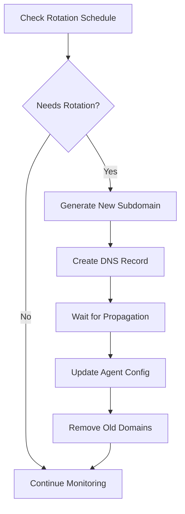
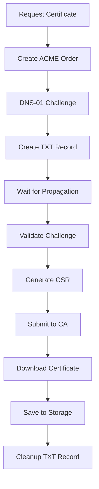

# Infrastructure Management

The Rust-Nexus infrastructure management system provides enterprise-grade automation for DNS management, certificate provisioning, and operational security through dynamic domain rotation.

## Overview

The `nexus-infra` crate handles:
- **Cloudflare DNS API**: Automated subdomain creation and management
- **Let's Encrypt Integration**: DNS-01 challenge certificate automation
- **Origin Certificates**: Cloudflare origin certificate management
- **Domain Health**: Continuous monitoring and failover
- **gRPC Communication**: Enhanced secure communication layer

## Architecture Components

```
┌─────────────────────┐     ┌─────────────────────┐     ┌─────────────────────┐
│  Domain Manager     │────►│  Cloudflare API     │────►│      DNS Zone       │
│                     │     │                     │     │                     │
│ • Subdomain Gen     │     │ • Record CRUD       │     │ • A/AAAA Records    │
│ • Health Monitoring │     │ • Zone Management   │     │ • TXT Challenges    │
│ • Rotation Schedule │     │ • Proxy Settings    │     │ • Geographic LB     │
└─────────────────────┘     └─────────────────────┘     └─────────────────────┘
           │                           │                           │
           ▼                           ▼                           ▼
┌─────────────────────┐     ┌─────────────────────┐     ┌─────────────────────┐
│  Cert Manager       │────►│  Let's Encrypt      │────►│   Certificate       │
│                     │     │                     │     │      Store          │
│ • ACME Client       │     │ • DNS-01 Challenges │     │                     │
│ • Auto-Renewal      │     │ • Certificate Issue │     │ • PEM Files         │
│ • Validation        │     │ • Account Mgmt      │     │ • Private Keys      │
└─────────────────────┘     └─────────────────────┘     └─────────────────────┘
```

## Quick Setup

### 1. Cloudflare Prerequisites

Before using the infrastructure system, ensure you have:

```bash
# Cloudflare API token with permissions:
# - Zone:Read, Zone:Edit
# - DNS:Read, DNS:Edit
# - SSL and Certificates:Read, SSL and Certificates:Edit

# Zone ID for your domain
# Domain managed by Cloudflare DNS
```

### 2. Configuration

Create a configuration file (`nexus.toml`):

```toml
[cloudflare]
api_token = "your_cloudflare_api_token_here"
zone_id = "your_zone_id_here"
domain = "yourdomain.com"
proxy_enabled = true  # Enable Cloudflare proxy (orange cloud)
ttl = 300            # 5-minute TTL for DNS records

[letsencrypt]
contact_email = "admin@yourdomain.com"
challenge_type = "Dns01"
cert_renewal_days = 30
wildcard_enabled = true
acme_directory_url = "https://acme-v02.api.letsencrypt.org/directory"
cert_storage_dir = "./certs"

[domains]
primary_domains = ["c2.yourdomain.com"]
backup_domains = ["backup.yourdomain.com", "fallback.yourdomain.com"]
rotation_interval = 24        # Hours between rotations
max_subdomains = 10          # Maximum concurrent subdomains
health_monitoring = true
dns_timeout = 5

[security]
additional_encryption = true
traffic_obfuscation = true
anti_analysis = { vm_detection = true, debugger_detection = true, sandbox_detection = true }
```

### 3. Initialize Infrastructure

```rust
use nexus_infra::*;

#[tokio::main]
async fn main() -> InfraResult<()> {
    // Load configuration
    let config = NexusConfig::from_file("nexus.toml")?;
    
    // Initialize Cloudflare manager
    let cf_manager = CloudflareManager::new(config.cloudflare.clone())?;
    cf_manager.verify_access().await?;
    
    // Initialize domain manager
    let domain_manager = DomainManager::new(config.domains.clone(), cf_manager.clone()).await?;
    domain_manager.initialize().await?;
    
    // Initialize certificate manager
    let mut cert_manager = CertificateManager::new(config.letsencrypt.clone(), cf_manager);
    cert_manager.initialize().await?;
    
    println!("Infrastructure initialized successfully!");
    Ok(())
}
```

## Component Deep Dive

### Domain Manager

The domain manager handles dynamic DNS operations:

```rust
// Create new C2 subdomain
let domain = domain_manager.create_new_domain().await?;
println!("Created: {} -> {}", domain.full_domain, domain.ip_address);

// Rotate domains on schedule
if domain_manager.needs_rotation().await {
    let new_domains = domain_manager.rotate_domains().await?;
    println!("Rotated to {} new domains", new_domains.len());
}

// Health monitoring
let health = domain_manager.check_domain_health().await?;
for status in health {
    println!("{}: {} ({}ms)", status.domain, status.status, 
             status.response_time_ms.unwrap_or(0));
}
```

### Certificate Manager

Automated certificate lifecycle management:

```rust
// Request new certificate
let cert_info = cert_manager.request_certificate(
    "*.yourdomain.com",
    &["api.yourdomain.com", "cdn.yourdomain.com"]
).await?;

// Check renewal status
let status = cert_manager.check_renewal_status(&cert_info);
if status == RenewalStatus::Needed {
    let new_cert = cert_manager.renew_certificate_if_needed(&cert_info).await?;
}
```

### Cloudflare Manager

Direct DNS API operations:

```rust
// Create C2 subdomain
let record = cf_manager.create_c2_subdomain("random123", "203.0.113.10").await?;

// Create ACME challenge
let challenge = cf_manager.create_acme_challenge(
    "_acme-challenge.yourdomain.com", 
    "challenge_value_here"
).await?;

// Update existing subdomain
let updated = cf_manager.update_c2_subdomain("random123", "203.0.113.20").await?;
```

## Operational Workflows

### Domain Rotation Workflow



### Certificate Provisioning Workflow



## Monitoring & Maintenance

### Health Monitoring

```rust
// Set up automated health monitoring
tokio::spawn(async move {
    let mut interval = tokio::time::interval(Duration::from_secs(60));
    
    loop {
        interval.tick().await;
        
        // Check domain health
        if let Ok(health_results) = domain_manager.check_domain_health().await {
            for health in health_results {
                if health.uptime_percentage < 95.0 {
                    warn!("Domain {} health degraded: {:.1}%", 
                          health.domain, health.uptime_percentage);
                }
            }
        }
        
        // Check certificate expiry
        let certificates = cert_manager.list_certificates()?;
        for cert in certificates {
            if cert_manager.check_renewal_status(&cert) == RenewalStatus::Needed {
                info!("Certificate renewal needed: {}", cert.domain);
            }
        }
    }
});
```

### Automated Maintenance

```rust
// Daily maintenance routine
async fn daily_maintenance(
    domain_manager: &DomainManager,
    cert_manager: &mut CertificateManager,
) -> InfraResult<()> {
    // Clean up old domains
    let keep_patterns = vec!["primary".to_string(), "backup".to_string()];
    let removed = cf_manager.cleanup_old_subdomains(&keep_patterns).await?;
    info!("Cleaned up {} old domains", removed.len());
    
    // Rotate domains if scheduled
    if domain_manager.needs_rotation().await {
        domain_manager.rotate_domains().await?;
    }
    
    // Renew certificates if needed
    let certificates = cert_manager.list_certificates()?;
    for cert in certificates {
        cert_manager.renew_certificate_if_needed(&cert).await?;
    }
    
    Ok(())
}
```

## Security Considerations

### **API Key Security**
- Store Cloudflare API tokens securely (environment variables, key vaults)
- Use least privilege permissions for API tokens
- Rotate API keys regularly
- Monitor API usage for anomalies

### **Certificate Security**
- Use strong private keys (RSA 2048+ or ECDSA P-256+)
- Implement proper certificate storage with restricted permissions
- Monitor certificate transparency logs
- Have certificate revocation procedures ready

### **Domain Security**
- Use randomized subdomain generation
- Implement domain rotation schedules
- Monitor domain reputation
- Have domain burn procedures for compromised infrastructure

### **Operational Security**
- Automate infrastructure changes to reduce human error
- Implement comprehensive logging and audit trails
- Use geographic distribution for resilience
- Have incident response procedures for infrastructure compromise

## Next Steps

1. **[Cloudflare Setup Guide](cloudflare-setup.md)** - Detailed Cloudflare configuration
2. **[Certificate Guide](certificates.md)** - Certificate management deep dive
3. **[Production Deployment](../configuration/production-setup.md)** - Enterprise setup
4. **[Monitoring Setup](../operations/monitoring.md)** - Infrastructure monitoring
